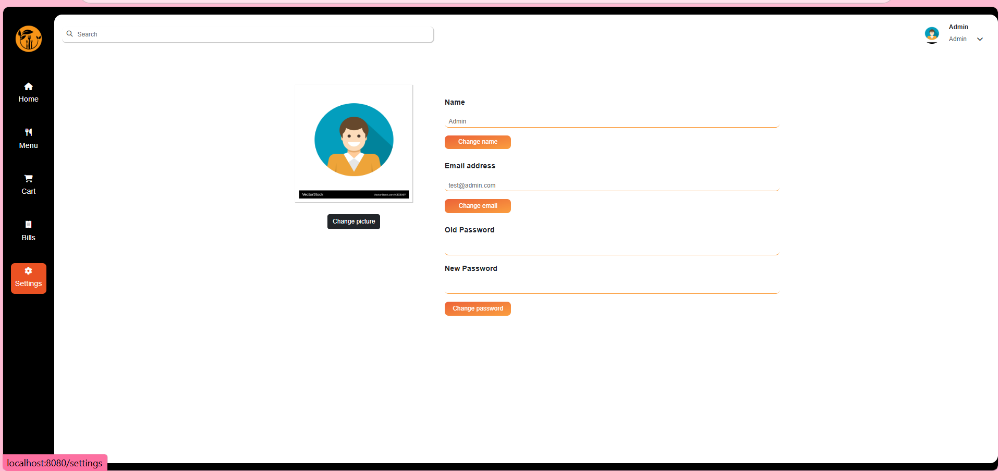
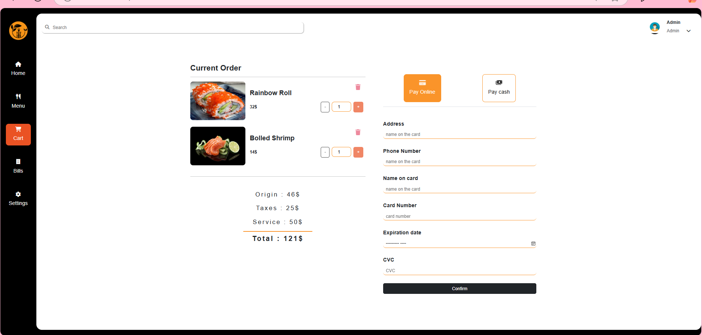
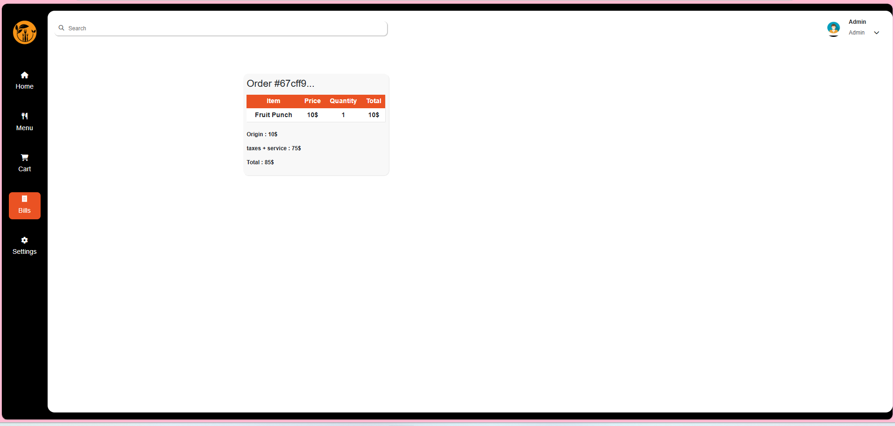

# 🍽️ Web Restaurant  

## 🚀 Introduction  
Web Restaurant is an online restaurant booking and management platform that allows customers to search, reserve tables, and leave reviews effortlessly.  

## 🎯 Features  
- 🏪 **Restaurant Management**: Add, edit, and delete restaurants.  
- 📅 **Online Table Booking**: Customers can reserve tables in advance.  
- ⭐ **Reviews & Comments**: Users can leave ratings and comments.  
- 🔍 **Search & Filter Restaurants**: Find restaurants by location, price, or cuisine type.  
- 🛠️ **Menu Management**: Support for adding food images.  
- 🔐 **User Authentication**: Sign up, log in, and role-based access control.  

## 🛠️ Tech Stack  
- **Frontend**: Vue.js (Vue Router, Vuex), Tailwind CSS  
- **Backend**: Node.js, Express.js, MongoDB, Multer (for image uploads)  
- **Payment Integration**: Stripe  
- **Deployment**: Netlify (Frontend), Render/Heroku (Backend)  

## 📦 Installation & Setup  
### 🔹 Project setup
```bash
npm install
### 🔹 Compiles and hot-reloads for development
```bash
npm run serve
### 🔹 Clone the repository  
```bash
git clone https://github.com/your-username/Web-Restaurant.git
cd Web-Restaurant

#🌎 Image Demo




